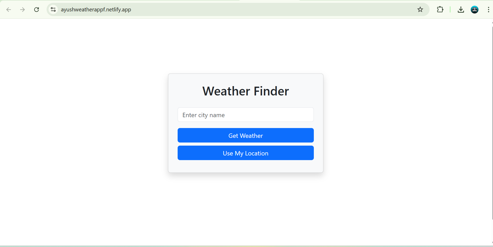

# 🌤️ Ayush Weather App

A sleek and responsive weather forecast app built using **React.js** and **Bootstrap**. It uses a weather API to fetch real-time data such as temperature, weather conditions, location, and more — making it a great project for frontend portfolios.

> 🌐 **Live Demo**: [https://ayushweatherappf.netlify.app/](https://ayushweatherappf.netlify.app/)

---

## 📸 Preview

 <!-- Add a screenshot named like this in a 'screenshots' folder -->

---

## 🚀 Features

- 🌍 **City-based Weather Search** – Type any city to get real-time weather
- 🌡️ **Temperature Display** – Current temperature with weather icon
- 📅 **Date & Time Info** – Shows current date/time of the city
- 🎨 **Bootstrap Styling** – Clean and responsive UI
- 🔁 **API Integration** – Uses OpenWeatherMap or other weather API

---

## 🛠️ Tech Stack

- **React.js** – Functional components and hooks
- **Bootstrap** – Responsive layout and styling
- **JavaScript (ES6)** – Logic and interactivity
- **Axios / Fetch API** – API calls for weather data
- **Weather API** – OpenWeatherMap or similar service

---

## 📁 Folder Structure (Simplified)


weather-app/
├── public/
│ └── index.html
├── src/
│ ├── components/
│ │ └── WeatherCard.jsx
│ ├── App.js
│ ├── index.js
│ └── styles.css
├── .env
├── .gitignore
├── package.json
└── README.md


---

## 🔧 How to Run Locally

```bash
1. Clone the repository
2. Run `npm install` to install dependencies
3. Add your weather API key in `.env`:
   REACT_APP_WEATHER_API_KEY=your_api_key_here
4. Run `npm start` to launch locally

📸 Screenshots
(Add screenshots of the main UI interface inside a screenshots/ folder and name them like weather-preview.png)

👤 Author
Ayush
Frontend Developer | React Enthusiast | Computer Engineering Fresher

🌐 Contact
✉️ Email: ayushkumbhalkar68@gmail.com

🔗 LinkedIn: https://www.linkedin.com/in/ayush-kumbhalkar-440403296

🐙 GitHub: https://github.com/FrontendwithAyush

📦 Hosting
Deployed on Netlify – https://ayushweatherappf.netlify.app/
