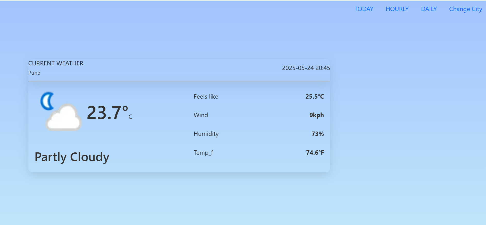
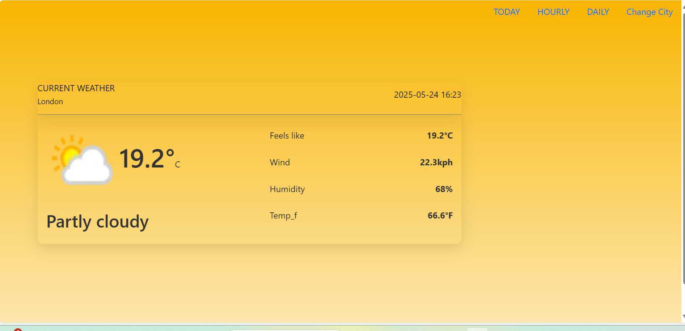
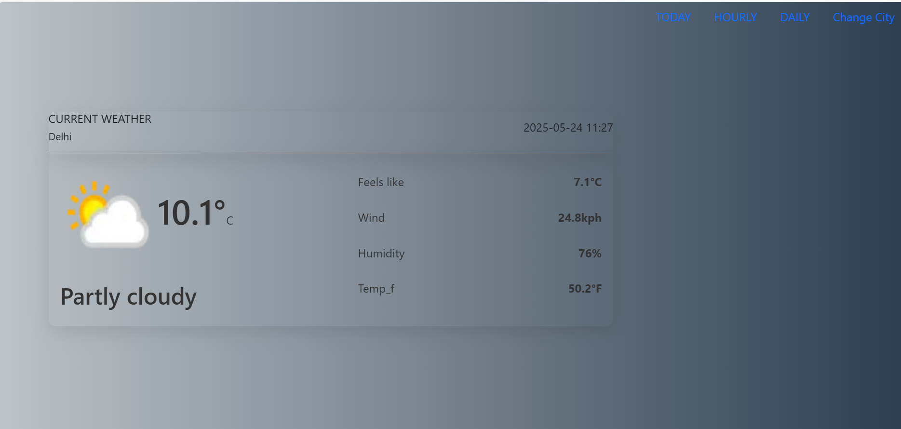
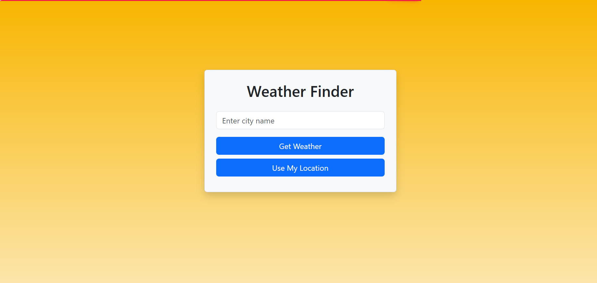
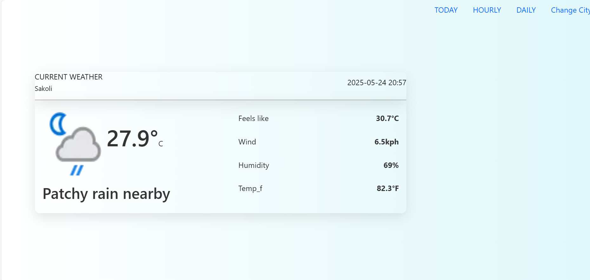
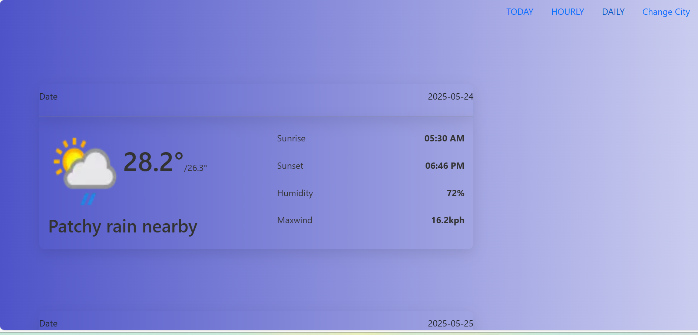

# 🌤️ Ayush Weather App

A sleek and responsive weather forecast app built using **React.js** and **Bootstrap**. It uses a weather API to fetch real-time data such as temperature, weather conditions, location, and more — making it a great project for frontend portfolios.

> 🌐 **Live Demo**: [https://ayushweatherappf.netlify.app/](https://ayushweatherappf.netlify.app/)

---

## 📸 Preview

 <!-- Add a screenshot named like this in a 'screenshots' folder -->

## 🚀 Features

- 🌍 **City-based Weather Search** – Type any city to get real-time weather
- 🌡️ **Temperature Display** – Current temperature with weather icon
- 📅 **Date & Time Info** – Shows current date/time of the city
- 🎨 **Bootstrap Styling** – Clean and responsive UI
- 🔁 **API Integration** – Uses OpenWeatherMap or other weather API

---

## 🛠️ Tech Stack

- **React.js** – Functional components and hooks
- **Bootstrap** – Responsive layout and styling
- **JavaScript (ES6)** – Logic and interactivity
- **Axios / Fetch API** – API calls for weather data
- **Weather API** – OpenWeatherMap or similar service
- **Environment Variables** – To store and use your API key securely

---

## 📁 Folder Structure (Simplified)

weather-app/
├── public/
│ └── index.html
├── src/
│ ├── components/
│ │ └── WeatherCard.jsx
│ ├── App.js
│ ├── index.js
│ └── styles.css
├── .env
├── .gitignore
├── package.json
└── README.md

---

## 🚀 How to Run Locally

1. Clone the repository  
2. Run `npm install` to install dependencies  
3. Add your weather API key in `.env`
REACT_APP_WEATHER_API_KEY=your_api_key_here
4. Run `npm start` to launch locally  

---

## 📸 Additional Screenshots

 

---

## ✍️ Author  
**Ayush**  
Frontend Developer | React Enthusiast | Computer Engineering Fresher  

## 📬 Contact  
- **Email**: ayushkumbhalkar680@gmail.com  
- **LinkedIn**: [https://www.linkedin.com/in/ayush-kumbhalkar-440843296](https://www.linkedin.com/in/ayush-kumbhalkar-440843296)  
- **GitHub**: [https://github.com/FrontendwithAyush](https://github.com/FrontendwithAyush)  

## ☁️ Hosting  
Deployed on Netlify – [https://ayushweatherappf.netlify.app](https://ayushweatherappf.netlify.app)  
